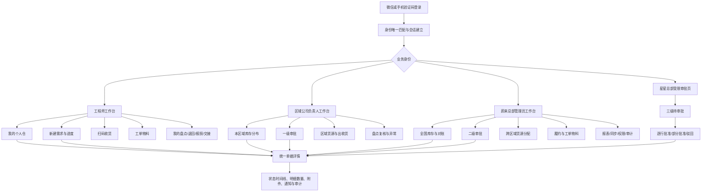
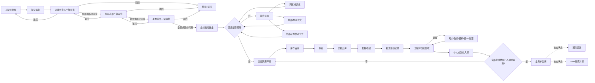

# RSC个人仓与物资运营扩展系统——正式生产版需求与架构设计 V1.0

- 文档日期：2026-08-30
- 文档状态：需求基线已确认，可进入原型、详细设计和开发排期
- 建设方：蔚来侧
- 业务背景：蔚来作为星星充电家桩维修服务承接方，需要在星星 OAM 只提供有限账号、库存只能查看到省级颗粒度、且无正式写接口的条件下，建设独立的物资运营扩展系统。

## 0. 最终产品定位

本系统不是完整复制星星 OAM，也不替代报价、支付、开票、客户、设备和完整工单域。正式范围限定为：

1. 物资与 SKU 查询。
2. 总部、区域及工程师个人仓管理。
3. 个人物资需求、三级审批、缺货补货及跨区域调拨。
4. 分配、占用、出库、发运、收货和个人仓入账。
5. 工单物料占用、消耗、释放及旧坏件回收。
6. 盘点、人员间调拨、退回、报损、报废和离职交接。
7. 报表、Excel 导入导出、二维码、打印、通知、权限和审计。
8. 在星星 OAM 只读数据基础上提供更细颗粒度、更完整、更好用的查询与对账。

### 0.1 系统主责

| 数据域 | 主写系统 | 新系统职责 | 写回 OAM |
|---|---|---|---|
| 组织、人员、SKU、OAM 工单引用、历史单据 | 星星 OAM | 只读同步、保存版本、增强查询 | 禁止 |
| OAM 省级库存 | 星星 OAM | 作为省级控制总账参与对账，不直接生成个人仓库存 | 禁止 |
| 个人仓、区域内细分库存、保管责任 | 新系统 | 唯一业务主账 | 禁止 |
| 需求、内部两级审批、货源分配和履约 | 新系统 | 唯一业务主账 | 禁止 |
| 星星总部第三级审批 | 星星总部审批人 | 在新系统受限审批，或登记外部审批证据 | 无正式接口时禁止自动回写 |
| 库存流水、盘点、报损报废、交接 | 新系统 | 唯一库存事实源 | 禁止 |

### 0.2 个人仓定义

个人仓是“每人一个虚拟库存位置 + 个人保管责任”，不是资产法律所有权转移给自然人。

每笔库存必须同时区分：

- 资产所有组织：区域公司。
- 保管责任人：工程师或仓库责任人。
- 库存位置：总部、区域、个人、隔离、运输中。
- SKU、成色、批次/SN、可用状态。

省级库存、区域仓和个人仓不能分别保存重复余额。个人仓是库存位置树的叶子节点，省级数据由下级位置汇总；OAM 省级库存只作为外部控制总账进行左右对账，绝不与新系统库存相加。

### 0.3 首次建立个人仓的规则

OAM 只能看到省级库存，无法可靠推导每位工程师实际持有数量。因此：

1. 以 OAM 省级余额作为控制总数。
2. 对区域仓和工程师个人仓执行首次实物盘点。
3. 经区域负责人及蔚来总部管理员复核后，生成“期初入账流水”。
4. 无法归属的差额进入“待核实差异”，不得平均分配、猜测归属或自动覆盖。
5. 期初日以后，新系统个人仓只由库存流水维护。

## 1. 功能清单

### 1.1 角色

| 角色 | 数据范围 | 主要职责 |
|---|---|---|
| 蔚来总部管理员 | 全国 | 系统配置、二级审批、全国货源统筹、跨区域调拨、盘点差异复核、报损报废终审、数据映射、报表和审计 |
| 区域公司负责人 | 本区域 | 一级审批、区域库存管理、货源建议、盘点管理、报损和离职交接初审、本区域报表 |
| 工程师 | 本人及本人执行工单 | 个人仓、需求申请、扫码收货、工单投料、本人盘点、退回报损和交接 |
| 星星总部审批人（外部审批身份） | 仅待其审批的申请字段 | 第三级逐行审批；不授予库存、人员、报表或系统配置权限 |

不保留独立的审计员和仓库管理员角色。审计查询能力归蔚来总部管理员；区域实物仓操作由区域公司负责人完成。

申请人不得审批自己的申请。审批代理必须有明确生效时间、范围和授权记录。

### 1.2 最新版 PC 菜单

| 一级菜单 | 二级页面 | 主要功能 | 主要角色 | 优先级 |
|---|---|---|---|---|
| 工作台 | 全国/区域/个人工作台 | 待审批、待占用、待发货、在途、待收货、盘点差异、库存异常、同步健康 | 全部 | P0 |
| 任务中心 | 我的待办、异常任务、超时任务 | 聚合审批、收货、盘点、退回、交接及异常处理 | 全部 | P0 |
| OAM 数据 | 组织、人员、SKU、历史单据、OAM 工单 | 只读查询、来源时间、版本、原始详情、导出 | 总部、区域；工程师仅本人相关 | P0 |
| 库存中心 | 库存总览、区域库存、个人仓、SN/批次、在途、冻结、流水 | 多维查询、占用、差异、账龄、追溯 | 全部按数据范围 | P0 |
| 需求中心 | 需求列表、新建需求、审批中心、缺货任务 | 三级逐行审批、部分审批、替代料、撤回、取消、挂起 | 全部 | P0 |
| 履约中心 | 货源分配、占用、拣货、出库、发运、收货、入库 | 多仓分配、分批发料、多包裹、多次收货、异常处理 | 总部、区域 | P0 |
| 工单物料 | 待投料、已占用、已消耗、已释放、旧坏件回收 | 绑定 OAM 工单、三码校验、消耗和回收 | 全部按数据范围 | P0 |
| 盘点中心 | 盘点计划、盘点任务、实盘、复盘、差异审批 | 全盘、抽盘、个人盘点、离职盘点、盘盈盘亏 | 全部按数据范围 | P0 |
| 库存作业 | 人员间调拨、退回、报损、报废、离职交接 | 保管责任转移、状态转换、证据和审批 | 全部按数据范围 | P1 |
| 报表中心 | 库存、需求、履约、工单、盘点、差异、同步 | 筛选、订阅、Excel 导出 | 总部、区域 | P0 |
| 消息中心 | 业务通知、库存变动、送达记录 | 微信、短信、飞书机器人，失败重试和回执 | 全部 | P1 |
| 系统管理 | 登录身份、权限范围、参数、模板、同步、导入导出、审计 | 手机/微信、区域范围、规则、接口健康、不可变审计 | 总部 | P0 |

### 1.3 工程师小程序菜单

底部导航建议保持五个入口：

1. 工作台：本人待办、待收货、待盘点、异常和通知。
2. 个人仓：可用、占用、冻结、在途、旧件、坏件、SN/批次和流水。
3. 扫码：收货、投料、盘点、退回、人员间交接统一扫码入口。
4. 需求：新建需求、审批进度、部分批准、缺货、发运和收货。
5. 我的：工单物料、报损退回、离职交接、消息和登录设备。

区域负责人小程序额外显示一级审批、区域盘点复核和收货异常；复杂的全国货源分配、系统配置和批量操作只在 PC 端提供。

### 1.4 登录与账号

- 仅支持微信登录或手机验证码登录，正式环境不提供密码登录。
- 微信身份、手机号和 OAM 人员必须建立唯一映射。
- 首次登录必须完成身份匹配；无法唯一匹配时阻断，不允许猜测人员。
- OAM 人员停用或离职后，冻结新申请和新投料，保留登录到交接页面的受限能力。
- 支持设备会话、刷新令牌轮换、管理员强制下线、异常登录告警。
- 验证码发送、校验、失败次数、频控和登录均留审计记录。

### 1.5 OAM 只读查询与同步

- 同步组织、人员、SKU、仓库/省级库存控制数、历史单据、附件索引、审批记录、操作时间和 OAM 工单引用。
- 每条数据展示来源系统、来源 ID、来源更新时间、本次同步时间和数据新鲜度。
- 支持全量快照、增量同步、记录数/hash 校验、重复幂等、失败隔离、人工重跑和日终对账。
- 当前没有正式 API 或数据库读取权限时，使用授权管理员账号所在本地边缘端只读采集；OAM Token、Cookie、验证码和密码永不上传云端。
- 若未来获得正式数据库只读副本或 API，只替换采集适配器，不改变业务数据模型。
- 同步数据先进入隔离镜像区，通过校验后再更新只读投影，永不直接写新系统库存流水或余额。
- 首期禁止任何形式回写 OAM 数据库。

### 1.6 库存与个人仓

库存维度：

```text
资产所有组织 + 库存位置 + 保管人 + SKU + 成色 + 可用状态 + 批次/SN
```

成色与库存状态必须分开：

- 成色：新件、旧件、坏件、已报废。
- 库存状态：可用、已占用、待拣货、待出库、在途、到货待验、冻结、待退回、待报废。

核心功能：

- 全国、区域、个人、SKU、批次、SN、成色和状态多维查询。
- 个人仓是区域公司和省级库存汇总的组成部分，但不重复记账。
- 所有变动只通过业务单和不可变流水发生，禁止管理员直接修改余额。
- 支持人员间调拨、区域退回、跨区域调拨、冻结、解冻、成色转换、报损和报废。
- 支持二维码打印、扫码查询、SN 唯一性校验、批次有效期和账龄。
- 支持库存流水冲销，不允许删除已过账流水。

库存口径：

```text
可用量 = 实物在库量 - 已占用量 - 冻结量
资产总量 = 实物在库量 + 物理在途量
```

“星星总部审批通过后的预计到货”单独显示为预计供应，不算物理在途；只有实物出库或承运交接后才进入在途。

### 1.7 个人需求与三级审批

需求头字段：申请人、所属区域、OAM 工单、用途、紧急程度、期望日期、收货地址、联系人、附件和备注。

需求明细字段：SKU、申请数量、建议替代料、各级批准数量、已分配、已占用、已发出、已收货、缺货和取消数量。

三级审批：

1. 区域公司负责人。
2. 蔚来总部管理员。
3. 星星总部管理员。

审批规则：

- 每一级按“申请明细 + 数量”审批。
- 后一级可批准数量不得超过前一级批准数量。
- 任一级可部分同意、部分驳回、退回补充或整单驳回，并必须填写理由。
- 后级需要增加数量时必须退回前级重审。
- 支持申请人在允许时点撤回；审批后取消必须走补偿流程并释放占用。
- 三级审批完成不等于库存占用；确定来源库存并分配后才占用。
- 缺货可以拆为跨区域调拨、总部补货或外部采购/星星补货任务。系统只跟踪外部采购参考号、数量和预计日期，不建设供应商、合同、价格、付款等完整采购域。
- 支持替代料关系、替代比例、申请人确认和重新占用。

星星总部审批建议提供两个模式：

- 正式模式：给星星总部审批人开通仅限审批的微信/短信身份。
- 过渡模式：系统生成外部审批任务；蔚来总部上传星星审批证据，另一名总部管理员复核后登记结果。此模式必须显示“外部登记”，不能伪装为星星账号直接审批。

### 1.8 分配、占用、发运、收货与入账

- 一条需求明细可从多个来源位置分配。
- 一次分配可以部分占用、部分释放。
- 支持多次拣货、分批出库、多个包裹、分批收货。
- 首期不接物流平台；承运商、运单号、发货时间、签收凭证和物流状态采用人工登记或文件导入。
- “已出库”“已发货”“物流签收”“OAM 收货”“RSC/个人仓入库”分别保存，不相互替代。
- 收货支持正常、短少、破损、错料、错 SN 和拒收。
- 每一次确认收货独立生成个人仓入账流水。
- 只有每条最终批准明细全部入库或取消，业务单才允许关闭。
- 通知失败、OAM 同步失败或台账对账差异作为独立异常，不改变已经发生的库存事实。

### 1.9 工单物料

- 工单编号、工程师和工单状态从 OAM 只读镜像校验。
- 工程师只能操作本人有效工单和本人个人仓。
- 个人仓不支持无工单的直接领用消耗。
- 批量投入先整体预检；任一物料不足则整批不占用。
- 投入提交即进入占用；实际消耗时同时减少占用和现有库存。
- 未使用物料可释放占用。
- 以换代修同时记录投入新件和拆回旧/坏件，受控物料执行二维码、SKU、SN 三码校验。
- 拆回件进入个人仓旧件或坏件账户，之后必须通过退回单解除个人保管责任。
- 工单结束前检查未释放占用、待回收和待退回物料。

### 1.10 盘点

- 支持全盘、抽盘、临时盘点、个人自盘和离职交接盘点。
- 支持明盘/盲盘、截止时点账面快照、扫码盘点和 SN 逐件盘点。
- 支持初盘、复盘、差异原因、照片/视频和差异审批。
- 差异分类：缺失、多余、错位置、错成色、错批次、错 SN。
- 盘点期间可配置整范围冻结；如允许业务继续，则按截止流水游标回算，不允许直接使用当前余额比较。
- 差异审批后生成盘盈/盘亏/状态转换流水，禁止覆盖余额。
- 任务关闭前必须完成账面、实盘、流水和 SN 对账。

盘点状态：

```text
草稿 → 已下发 → 已冻结 → 盘点中 → 已提交
                              ↓
                         需要复盘 → 差异审批 → 已过账 → 已关闭
```

### 1.11 报损、报废和离职交接

报损与报废分开：

- 工程师提交报损后先冻结对应库存。
- 区域负责人核实，蔚来总部管理员审批。
- 审批结果可以是恢复可用、转旧件、转坏件、退回或报废。
- 报废批准后才从可管理资产中移出，并生成不可变流水。
- 误报或失而复得使用反向冲销单，不删除原记录。

离职交接：

1. OAM 人员状态变为离职或停用，生成交接预警。
2. 禁止该人员新申请和新投料。
3. 创建个人仓盘点并检查现有、占用、冻结和在途。
4. 未完成工单、需求、报损和退回逐项处理。
5. 分批退回区域仓或移交另一工程师，双方确认。
6. 个人仓归零、未结事项清零后，区域负责人和总部管理员复核关闭。

### 1.12 报表、导入导出、扫码和打印

一期报表：

- 全国/区域/个人库存余额及成色、状态、批次、SN。
- OAM 省级控制数与新系统明细账差异。
- 个人仓账龄、呆滞件、旧坏件未退和周转率。
- 需求申请、各级审批、缺货、占用、发运和收货漏斗。
- 工单物料占用、消耗、回收和未退回。
- 盘点完成率、差异率、复盘率和盘盈盘亏。
- 库存流水守恒、负数、重复 SN、重复入账异常。

导入导出：

- Excel 导出异步生成，记录申请人、筛选条件、文件 hash 和下载次数。
- 导入必须先预校验并生成错误报告，再由有权限人员确认执行。
- OAM 主数据不允许通过 Excel 覆盖；Excel 仅用于期初盘点、批量任务和授权的辅助数据。
- 支持打印出库单、收货单、个人仓交接单和盘点单。
- 支持物料、批次、SN、库存位置二维码。

### 1.13 通知与飞书机器人

- 任一库存事实变化都生成通知事件；受影响工程师即时通知。
- 来源方发货并使物资进入该工程师的物理在途后，立即通知目标工程师，并展示来源、数量、运单和预计到达信息。
- 区域负责人收到本区域异常及可配置的汇总，总部管理员收到全国重大异常。
- 渠道支持微信订阅消息、短信和飞书机器人。
- 飞书审批由新系统替代；机器人用于通知、查询和跳转，不以“消息已发出”代替业务完成。
- 双向机器人回调必须验签、鉴权和幂等；涉及审批或库存写操作时仍调用新系统正式业务接口并重新校验权限。
- 保存渠道、收件人、provider message id、发送、送达、已读、失败和重试记录。

## 2. 页面流程图

### 2.1 角色与页面导航



### 2.2 个人需求、审批和履约主流程



### 2.3 必须严格分开的状态轴

| 状态轴 | 典型状态 | 事实发生时点 |
|---|---|---|
| 申请 | 草稿、已提交、审批中、部分批准、已批准、驳回、撤回、取消 | 用户及审批动作 |
| 分配 | 未分配、部分分配、已分配、缺货 | 确定来源库存 |
| 占用 | 待占用、已占用、部分释放、已释放、已履约 | 库存账户状态移动 |
| 出库 | 待拣货、已拣货、已出库 | 实物离开来源位置 |
| 发运 | 待交运、已发货、运输中、异常 | 承运交接及人工物流事件 |
| 签收 | 未签收、已签收、拒收、异常 | 物流签收证据 |
| OAM 收货 | 未发生、已同步、异常 | OAM 只读记录，不驱动个人仓 |
| RSC/个人仓入库 | 待验收、部分验收、已验收、已过账 | 工程师确认且库存交易过账 |
| 通知 | 排队、已发送、已送达、已读、失败 | 渠道回执 |
| 同步/对账 | 待同步、已暂存、已校验、已对账、冲突、失败 | 同步批次和对账结果 |

## 3. 数据表设计

### 3.1 数据建模原则

- PostgreSQL 为唯一业务数据库。
- 主键使用 UUID；时间使用 `timestamptz`；数量使用 `numeric(18,3)`，禁止浮点数。
- OAM 外部对象保存来源系统、来源 ID、来源版本、来源时间和 payload hash。
- 已过账库存流水和审计事件只允许追加，禁止更新和删除。
- 余额、报表汇总和序列号当前位置均为可重建投影，不是第二事实源。
- 所有写接口使用幂等键；库存过账使用行级锁或乐观版本控制。
- 业务状态使用受控枚举或 `CHECK`，不使用无约束自由字符串。
- OAM 镜像库存和新系统库存绝不 `UNION` 求和，只能在对账表中左右比较。

### 3.2 组织、账号与权限域

| 表名 | 关键字段 | 用途与约束 |
|---|---|---|
| `organizations` | `id, external_object_id, code, name, parent_id, org_type, province_code, status` | OAM 只读组织投影；停用不删除 |
| `people` | `id, external_object_id, organization_id, employee_no, name, mobile_encrypted, employment_status` | OAM 人员投影；组织+工号唯一 |
| `users` | `id, person_id, account_status, last_login_at` | 本地登录主体；一个人员最多一个账号 |
| `auth_identities` | `user_id, identity_type, identifier_hash, verified_at` | 手机、微信身份唯一绑定 |
| `auth_sessions` | `user_id, refresh_token_hash, device_id, expires_at, revoked_at` | 设备会话及强制下线 |
| `login_challenges` | `mobile_hash, code_hash, purpose, attempts, expires_at, status` | 短信验证和频控，不保存明文验证码 |
| `roles` | `code, name, is_external` | 固定内部三角色和星星外部审批身份 |
| `permissions` | `resource, action, field_code` | 菜单、操作、字段权限定义 |
| `role_permissions` | `role_id, permission_id, effect` | 角色权限矩阵 |
| `role_assignments` | `user_id, role_id, scope_type, scope_id, valid_from, valid_to` | 区域、组织、仓库、个人和单据范围 |
| `approval_delegations` | `from_user_id, to_user_id, scope, valid_from, valid_to, evidence_file_id` | 审批代理，完整留痕 |

### 3.3 OAM 只读同步与迁移域

| 表名 | 关键字段 | 用途与约束 |
|---|---|---|
| `source_systems` | `code, name, mode, enabled` | OAM 等来源登记；OAM 模式固定只读 |
| `sync_runs` | `source_system_id, run_key, scope_key, mode, watermark_from, watermark_to, status, manifest_sha256` | 全量/增量同步批次；run_key 唯一 |
| `sync_batches` | `run_id, entity_type, sequence, record_count, body_sha256, status` | 分批接收、数量和 hash 校验 |
| `sync_inbox_events` | `external_event_id, entity_type, external_id, source_version, payload_jsonb, payload_sha256, status` | 幂等暂存；相同 ID 不同 hash 进入冲突 |
| `external_objects` | `source_system_id, entity_type, external_id, current_version_id, deleted_at` | 外部业务对象身份；三字段唯一 |
| `external_object_versions` | `external_object_id, source_version, source_updated_at, valid_from, valid_to, payload_jsonb, is_current` | 只追加历史版本；每个对象仅一个当前版 |
| `external_object_mappings` | `external_object_id, local_object_type, local_object_id, status, approved_by` | 人工确认映射，不自动合并库存 |
| `sync_conflicts` | `external_object_id, conflict_type, external_value, local_value, status, resolution` | 冲突隔离和人工处置 |
| `reconciliation_runs` | `scope, external_snapshot_at, local_ledger_cursor, status` | 省级控制数与本地明细账对账头 |
| `reconciliation_items` | `run_id, business_key, external_qty, local_qty, difference, status, explanation` | 仓库/SKU/成色粒度差异明细 |
| `migration_batches` | `batch_no, cutoff_from, cutoff_to, entity_type, source_count, target_count, hash, status` | 三年历史迁移及多次演练 |
| `migration_errors` | `batch_id, source_key, error_code, message, resolution_status` | 不完整关联、缺附件、字段异常 |

从简长军账号创建日期起迁移全租户关联数据时，先按日期选择全租户业务对象，再递归补齐其引用的组织、人员、SKU、单据上下游、审批、物流和附件。历史库存单据保存在只读镜像中，不重放为新系统库存流水；正式切换日只通过已复核的期初盘点生成一笔期初库存交易，避免重复入账。

### 3.4 物资、位置与保管责任域

| 表名 | 关键字段 | 用途与约束 |
|---|---|---|
| `materials` | `external_object_id, sku_code, name, specification, base_unit, status` | OAM SKU 当前投影；sku_code 唯一 |
| `material_inventory_policies` | `material_id, tracking_mode, quantity_scale, allow_fraction, effective_from, effective_to` | 无追踪/批次/SN/两者；有效期不重叠 |
| `material_substitutions` | `material_id, substitute_material_id, ratio, valid_from, valid_to, status` | 替代料及换算比例 |
| `stock_locations` | `code, name, location_type, owner_org_id, parent_id, custodian_person_id, status` | 总部、区域、个人、运输、隔离位置 |
| `custody_assignments` | `location_id, custodian_person_id, valid_from, valid_to, handover_case_id` | 保管责任历史；同一位置同一时点仅一名责任人 |
| `inventory_lots` | `material_id, lot_no, manufacture_date, expiry_date` | 物料+批次唯一 |
| `inventory_serials` | `material_id, serial_no, qr_code, lot_id, lifecycle_status` | 物料+SN 唯一；二维码唯一 |
| `qr_codes` | `code, object_type, object_id, status, printed_at` | 位置、物料、批次、SN 二维码 |

### 3.5 不可变库存流水域

| 表名 | 关键字段 | 用途与约束 |
|---|---|---|
| `stock_accounts` | `owner_org_id, custodian_person_id, location_id, material_id, condition_code, availability_bucket, lot_id` | 库存唯一维度；空值按相同处理的唯一约束 |
| `inventory_transactions` | `transaction_no, movement_type, source_document_type, source_document_id, idempotency_key, status, effective_at, posted_at, reversed_transaction_id` | 库存交易头；幂等键唯一；过账后不可修改 |
| `inventory_movements` | `transaction_id, from_account_id, to_account_id, quantity` | 账户间移动；数量必须大于 0；两端不得相同 |
| `inventory_movement_serials` | `movement_id, serial_id` | SN 与移动关联；SN 数量必须等于流水数量 |
| `stock_balances` | `stock_account_id, quantity, ledger_cursor, version` | 流水投影；只由统一过账服务更新 |
| `serial_current_positions` | `serial_id, stock_account_id, last_movement_id` | SN 当前归属投影；可由流水重建 |
| `stock_allocations` | `request_line_id, source_location_id, allocated_qty, status, allocation_no` | 一条申请明细多来源分配 |
| `stock_reservations` | `allocation_id, stock_account_id, reserved_qty, reserve_transaction_id, release_transaction_id, status` | 确定货源后才占用 |
| `allocation_serials` | `allocation_id, serial_id` | 占用指定 SN，避免重复分配 |

所有库存变动必须经过同一个原子过账入口：锁定相关账户、验证可用量和 SN、写不可变流水、更新余额投影、写审计和通知 outbox，在同一数据库事务中完成。

### 3.6 需求与审批域

| 表名 | 关键字段 | 用途与约束 |
|---|---|---|
| `material_requests` | `request_no, requester_person_id, requester_org_id, work_order_id, purpose, urgency, expected_date, address_snapshot, status` | 需求单头；request_no 唯一 |
| `material_request_lines` | `request_id, line_no, material_id, requested_qty, required_date, status` | 原始申请数量永不被审批数量覆盖 |
| `approval_route_versions` | `route_code, version, effective_from, effective_to` | 审批模板版本化 |
| `approval_route_step_defs` | `route_version_id, step_no, role_code` | 固定区域、蔚来总部、星星总部三步 |
| `approval_instances` | `request_id, route_version_id, status, current_step_no` | 每个申请只有一个有效实例 |
| `approval_steps` | `instance_id, step_no, assignee_user_id, assignee_snapshot, status, opened_at, decided_at` | 提交时冻结审批人快照 |
| `approval_step_line_decisions` | `step_id, request_line_id, input_qty, approved_qty, rejected_qty, reason` | 逐行、逐数量审批；后级不超过前级 |
| `approval_actions` | `instance_id, step_id, action, actor_id, comment, occurred_at` | 提交、同意、部分同意、驳回、退回、撤回历史 |
| `substitution_decisions` | `request_line_id, substitute_material_id, ratio, confirmed_by, status` | 替代料确认和重新分配 |
| `supply_tasks` | `request_line_id, supply_type, reference_no, expected_qty, expected_date, status` | 跨区、总部补货、星星补货或外部采购参考，不含完整采购财务域 |

### 3.7 出库、发运、收货与入账域

| 表名 | 关键字段 | 用途与约束 |
|---|---|---|
| `outbound_orders` | `outbound_no, source_location_id, status, picked_at, outbound_at` | 拣货与实物出库独立状态 |
| `outbound_lines` | `outbound_id, allocation_id, planned_qty, picked_qty, outbound_qty` | 一次分配可分多次出库 |
| `shipments` | `shipment_no, source_location_id, target_location_id, carrier, tracking_no, status, shipped_at` | 包裹/运单；shipment_no 唯一 |
| `shipment_lines` | `shipment_id, outbound_line_id, shipped_qty` | 分批发运；累计不超过出库数量 |
| `shipment_serials` | `shipment_line_id, serial_id` | SN 不得重复发运 |
| `logistics_events` | `shipment_id, event_type, event_time, source, evidence_file_id, idempotency_key` | 揽收、运输、签收、异常；首期人工或导入 |
| `receipts` | `receipt_no, shipment_id, receiver_user_id, status, confirmed_at` | 一张发货单允许多次收货 |
| `receipt_lines` | `receipt_id, shipment_line_id, accepted_qty, rejected_qty, damaged_qty` | 累计确认不得超过累计发货 |
| `receipt_serials` | `receipt_line_id, serial_id, result` | SN 管理物料逐件验收 |
| `receipt_exceptions` | `receipt_id, exception_type, description, status, resolution` | 短少、破损、错料、错 SN |
| `inbound_orders` | `inbound_no, receipt_id, target_location_id, status, posting_transaction_id` | 验收与库存过账分离 |
| `oam_receipt_evidence` | `external_object_id, shipment_id, status, source_time` | OAM 收货只读证据，不驱动本地入账 |

### 3.8 工单物料域

| 表名 | 关键字段 | 用途与约束 |
|---|---|---|
| `oam_work_orders` | `external_object_id, work_order_no, organization_id, engineer_person_id, status, source_updated_at` | OAM 工单只读当前投影 |
| `work_order_material_operations` | `operation_no, oam_work_order_id, operator_person_id, operation_type, status, posting_transaction_id` | 占用、释放、消耗、回收和冲销 |
| `work_order_material_lines` | `operation_id, material_id, stock_account_id, quantity, condition_before, condition_after` | 必须关联有效 OAM 工单和本人个人仓 |
| `work_order_material_serials` | `operation_line_id, serial_id, sku_verified, qr_verified` | 受控物料三码校验 |
| `replacement_pairs` | `oam_work_order_id, installed_serial_id, removed_serial_id` | 以换代修新旧件配对追溯 |

### 3.9 盘点、报损报废和交接域

| 表名 | 关键字段 | 用途与约束 |
|---|---|---|
| `stocktake_tasks` | `task_no, task_type, cutoff_ledger_cursor, status, blind_count, assignee_id` | 全盘、抽盘、个人、离职盘点 |
| `stocktake_scopes` | `task_id, location_id, material_id, condition_code` | 明确盘点范围 |
| `inventory_freezes` | `scope_key, freeze_mode, valid_from, valid_to, status` | 盘点冻结；有效范围不能重叠 |
| `stocktake_snapshot_lines` | `task_id, stock_account_id, book_qty, serial_snapshot` | 截止流水游标账面快照 |
| `stocktake_rounds` | `task_id, round_no, round_type, submitted_at` | 初盘、复盘；任务+轮次唯一 |
| `stocktake_count_lines` | `round_id, stock_account_id, counted_qty, reason, status` | 实盘数量和差异原因 |
| `stocktake_count_serials` | `count_line_id, serial_id, result` | SN 缺失、多余、错位 |
| `stocktake_reviews` | `task_id, reviewer_id, decision, comment` | 差异审批；通过后生成库存交易 |
| `stock_operation_orders` | `operation_no, operation_type, source_location_id, target_location_id, requester_id, status` | 人员间调拨、退回、报损、报废和成色转换共用单头 |
| `stock_operation_lines` | `operation_id, stock_account_id, material_id, quantity, target_condition, reason` | 通用库存作业明细及流水关联 |
| `employee_handover_cases` | `employee_id, target_person_id, target_location_id, status, started_at, closed_at` | 同一离职人员只能有一个未结束交接 |
| `employee_handover_checks` | `case_id, check_type, expected_qty, cleared, evidence` | 库存、SN、占用、在途、工单和异常清零检查 |

### 3.10 文件、通知、审计和批处理域

| 表名 | 关键字段 | 用途与约束 |
|---|---|---|
| `files` | `storage_key, sha256, size_bytes, mime_type, uploaded_by` | OSS 文件元数据；storage_key 唯一 |
| `document_attachments` | `document_type, document_id, file_id, attachment_type` | 业务附件；关键单据应补真实外键约束 |
| `notification_events` | `event_type, business_type, business_id, dedup_key, payload_jsonb` | 业务事实产生一次通知事件；dedup_key 唯一 |
| `notification_recipients` | `event_id, user_id, channel` | 接收人及渠道 |
| `notification_deliveries` | `recipient_id, status, provider_message_id, sent_at, delivered_at, read_at` | 发送与送达状态 |
| `notification_attempts` | `delivery_id, attempt_no, request_hash, response_code, error, attempted_at` | 重试证据 |
| `robot_inbound_events` | `provider_event_id, sender_id, action, payload_hash, status` | 飞书机器人双向回调；provider_event_id 唯一 |
| `outbox_events` | `event_type, aggregate_type, aggregate_id, payload_jsonb, status, attempts` | 业务事务内可靠事件投递 |
| `audit_events` | `actor_user_id, action, aggregate_type, aggregate_id, before_jsonb, after_jsonb, request_id, previous_hash, event_hash` | 只追加、链式 hash、按月归档 |
| `state_transition_events` | `aggregate_type, aggregate_id, from_status, to_status, reason, actor_id` | 每个业务状态转换历史 |
| `file_jobs` | `job_type, requested_by, parameters_jsonb, status, result_file_id, error_file_id` | Excel 导入、导出和打印异步任务 |
| `system_parameters` | `parameter_key, value_jsonb, version, effective_from, effective_to` | 审批阈值、通知、盘点和时效参数 |

### 3.11 核心数据库约束

1. 同一个 SN 同一时点只能位于一个库存账户。
2. SN 管理物料的流水数量必须等于关联 SN 数量。
3. 任一库存账户余额、占用、冻结和在途均不得为负。
4. `累计收货 ≤ 累计发货 ≤ 最终三级批准数量`。
5. `当前占用 + 已释放 + 已转出数量`不能超过分配数量。
6. 个人仓是叶子位置，父级库存只汇总不复制。
7. 资产所有组织与保管责任人分别统计，不得相加。
8. 审批、库存过账、收货、通知和同步均使用独立幂等键。
9. 已过账交易只能用反向交易冲销，不能删除或覆盖。
10. 业务单关闭前，所有最终批准明细必须全部入账或取消。

## 4. 建议技术栈

### 4.1 总体原则

沿用现有 `cloud_oam v0.9.0` 的 Python、React 和原生微信小程序路线，做生产级重构，不重写成另一套语言。采用“模块化单体 + 一个后台任务服务”，不拆微服务、不上 Kubernetes。

| 层次 | 建议 | 原因 |
|---|---|---|
| PC 前端 | React + TypeScript + Vite + Ant Design | 与现有代码一致，后台管理成熟 |
| 微信端 | 原生微信小程序 + TypeScript | 已有基础，扫码、相机和微信登录最直接 |
| 后端 | Python 3.12 + FastAPI + Pydantic + SQLAlchemy 2 | 沿用现有系统，开发维护成本低 |
| 数据库 | 阿里云 RDS PostgreSQL 16 | 事务、JSONB、约束、部分索引和审计能力适合库存账 |
| 数据迁移 | Alembic | 所有结构变更版本化、可复现、可审计 |
| 后台任务 | Celery + Redis，业务事务使用 PostgreSQL Outbox | 同步、通知、Excel、打印和重试；Redis 不作为库存事实源 |
| 文件 | 阿里云 OSS | 附件、盘点凭证、导入导出和打印文件 |
| 登录 | 微信登录 + 阿里云短信 | 符合无密码要求 |
| Excel | openpyxl / 流式 CSV | 1000 SKU 和三年数据规模足够 |
| 二维码/打印 | 服务端二维码 + HTML/PDF 模板 | 统一打印出入库和盘点单 |
| 边缘同步 | 本地只读采集代理 + HMAC/mTLS + 云端隔离暂存 | OAM 凭据不出本地、失败关闭 |
| 部署 | Docker、阿里云 ACR、Nginx/ALB | 简单、可回滚，不引入 K8s |
| 监控 | 阿里云 SLS + CloudMonitor + 应用错误跟踪 | 日志、告警、同步和任务健康 |
| CI/CD | Git 仓库 + 自动测试 + ACR 镜像 + 灰度发布 | 当前代码必须先纳入版本控制 |

### 4.2 生产部署建议

正式生产推荐：

- 2 台应用 ECS，部署 API、前端和 Worker，通过 ALB/SLB 访问。
- RDS PostgreSQL 高可用版，开启自动备份和时间点恢复。
- 阿里云 Redis 标准版，仅用于验证码、限流、短锁和任务队列。
- OSS 私有 Bucket，使用短时签名 URL，不公开业务附件。
- WAF、HTTPS、KMS/密钥托管、安全组和最小权限数据库账号。
- 开发、测试、预生产、生产四套逻辑隔离环境；生产数据不得复制到开发环境。

500 名以内用户、1000 个 SKU、三年单据无需微服务、消息中间件集群或分库分表。库存流水和审计可按月归档；先建立正确索引，再根据真实数据决定是否分区。

### 4.3 OAM 同步技术边界

```text
授权管理员账号所在本地边缘端
        ↓ 只读采集
完整快照/增量批次 + 数量/hash 校验
        ↓ HMAC/mTLS
云端 OAM 隔离镜像区
        ↓ 映射和校验
只读主数据投影/历史查询/省级对账

新系统库存流水 ──禁止──> OAM数据库
```

建议基准频率为每 30 分钟增量、每日一次完整快照；数据新鲜度目标不高于 45 分钟。只有获得正式只读数据库副本或 API 后，才将目标调整到 5 分钟以内。

## 5. 分阶段开发计划

以下按 1 名产品经理、2 名后端、2 名前端、1 名测试、兼职运维估算。现有 v0.9.0 可以复用界面、登录框架和同步骨架，但库存流水、审批和履约数据模型需要生产级重构，不能把已有演示功能直接视为正式版本。

### 阶段 0：需求冻结与生产准备（第 1 周）

- 冻结本文件、字段字典、权限矩阵、状态机和验收标准。
- 确认星星总部审批模式、OAM 只读授权和数据采集范围。
- 将现有代码纳入正式 Git 仓库，建立分支、代码评审和版本发布规则。
- 建立开发、测试、预生产环境和基础监控。
- 输出 OAM 字段映射、历史数据范围和数据质量报告模板。

交付门槛：关键需求无未决冲突；所有状态有唯一事实时点和负责人。

### 阶段 1：基础平台与 OAM 只读层（第 2–3 周）

- 微信/短信无密码登录、设备会话和账号停用。
- 三个内部角色、星星外部审批身份和数据范围权限。
- 组织、人员、SKU、工单引用只读投影。
- 同步批次、版本、校验、冲突、健康监控和日终对账。
- Alembic 迁移、审计、附件和 Outbox 基础。

交付门槛：OAM 凭据不进入云端；同步失败不污染当前投影；权限越权测试通过。

### 阶段 2：库存流水、个人仓与盘点（第 4–6 周）

- 库存账户、不可变流水、余额投影、占用、冻结、在途。
- 批次、SN、二维码和唯一性校验。
- 个人仓、区域汇总和 OAM 省级控制数对账。
- 首次盘点、初盘/复盘、差异审批和盘盈盘亏。
- 期初个人仓建立及差异待核实机制。

交付门槛：负库存、重复 SN、重复过账均为 0；任意余额可从流水重算。

### 阶段 3：需求与三级审批（第 7–9 周）

- 需求申请、附件、工单引用和地址快照。
- 区域、蔚来总部、星星总部三级逐行审批。
- 部分批准、部分驳回、退回、撤回、取消和审批代理。
- 替代料、缺货挂起、跨区域调拨及补货/采购参考任务。
- 审批超时和通知。

交付门槛：后级批准不超过前级；申请人不能自批；取消能完整释放占用。

### 阶段 4：履约与工单物料（第 10–12 周）

- 多来源分配、占用、拣货、出库、发运和人工物流事件。
- 多包裹、分批收货、异常收货和个人仓分批入账。
- 工单物料占用、释放、消耗、旧坏件回收和三码校验。
- 人员间调拨、退回、报损、报废和离职交接。

交付门槛：部分发料/部分收货数量守恒；库存入账与通知、OAM 收货状态完全分离。

### 阶段 5：报表、批量作业与生产非功能（第 13–14 周）

- 库存和工单明细一期报表、Excel 导出。
- 导入预校验、错误报告、二维码和打印。
- 微信、短信、飞书机器人通知及送达记录。
- 并发、性能、安全、备份恢复、发布回滚和故障演练。
- 第一次、第二次全量迁移演练。

交付门槛：500 用户规模压测通过；备份恢复、应用回滚和业务冲销各演练一次。

### 阶段 6：UAT、灰度和正式上线（第 15–18 周）

1. 总部 5–10 人内部试用。
2. 一个区域、小范围 SKU 灰度。
3. 扩展到 2–3 个区域、约 20% 用户。
4. 完成最终迁移演练、期初盘点、增量追平和分区域放量。
5. 上线后 1–2 周每日对账和生产护航。

正式上线门槛：

- 组织、人员、SKU 和历史单据迁移数量、关键字段及附件校验通过。
- 连续至少 3 天 OAM 省级控制数与新系统差异均有明确解释。
- 负库存、重复 SN、重复入账和未授权越权均为 0。
- 三级部分审批、多仓分配、分批发货、分批收货、取消释放、盘点和工单消耗通过 UAT。
- RPO 目标不高于 5 分钟，RTO 目标不高于 2 小时。
- 应用回滚、同步批次回退和真实业务冲销均演练通过。

### 5.1 “明天上线”的现实边界

明天可以交付：本需求基线、页面流程、核心数据模型、权限矩阵、可点击原型范围、迁移及上线方案。

明天不能安全交付：正式生产库存、三年历史迁移、持续 OAM 同步、微信小程序正式审核、三级审批和库存流水的完整生产验收。

若项目团队只有 1 名全栈开发，完整生产周期应按约 5–7 个月估算；若按上述 6 人核心团队并行推进，建议计划为 14–18 周。

## 6. 生产验收红线

1. 任何数量变化都有来源单据、不可变流水、操作者、时间、幂等键和前后账户。
2. 业务接口不能直接覆盖库存余额。
3. 审批、占用、出库、发货、签收、入账、通知和同步分别保存状态。
4. 每一条最终批准明细只有在全部入账或取消后才能关闭。
5. OAM 同步失败不得自动重试覆盖当前有效快照；应隔离、告警并重新查询。
6. OAM 控制总账与个人仓明细账有差异时必须保留原因和处理证据。
7. 星星外部审批、通知发送成功和物流签收都不能伪装成个人仓已经入账。
8. 生产数据写入、迁移和上线必须经过授权、演练和书面验收。
